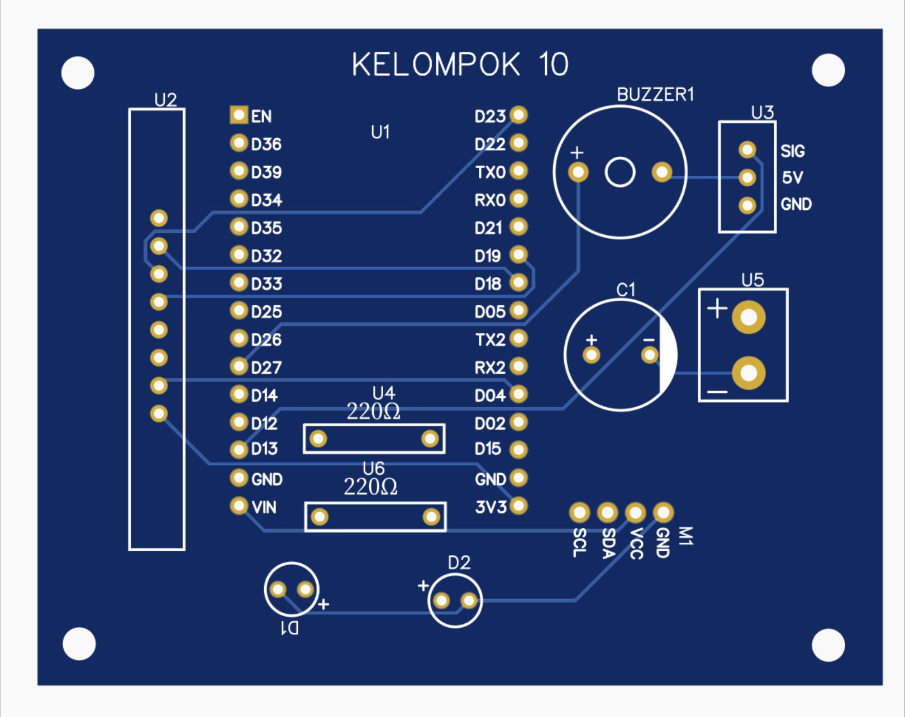

# 🚗 IoT Smart Parking System with Firebase

> Sistem parkir pintar berbasis IoT menggunakan ESP32, RFID, dan Firebase Realtime Database

[](https://opensource.org/licenses/MIT)
[](https://www.espressif.com/en/products/socs/esp32)
[](https://firebase.google.com/)
[](https://vuejs.org/)

## 📖 Tentang Project

Project ini merupakan implementasi sistem parkir pintar yang mengintegrasikan hardware IoT (ESP32 + RFID) dengan cloud database (Firebase) untuk menciptakan solusi parkir otomatis yang efisien dan real-time.

**Mata Kuliah**: Sistem Terdistribusi  
**Tahun**: 2026  
**Platform**: ESP32, Firebase, Vue.js

## ✨ Fitur Utama

### 🎯 Untuk Pengguna
- ✅ Registrasi kartu RFID melalui website
- ✅ Check-in otomatis dengan tap kartu
- ✅ Check-out otomatis dengan perhitungan biaya
- ✅ Manajemen saldo digital
- ✅ Riwayat parkir real-time
- ✅ Notifikasi WhatsApp/Telegram (opsional)

### 👨‍💼 Untuk Admin
- ✅ Dashboard monitoring real-time
- ✅ Manajemen pengguna
- ✅ Laporan transaksi lengkap
- ✅ Pencarian data per user
- ✅ Konfigurasi sistem

### ⚡ Teknologi & Optimasi
- **Fast Check-out**: ~500ms (optimisasi dari 2-3 menit)
- **Real-time Sync**: Update data langsung via Firebase
- **Secure Authentication**: Firebase Auth untuk ESP32 dan website
- **Responsive Design**: Bootstrap 5 untuk tampilan modern

## 🏗️ Arsitektur Sistem

```
┌──────────────┐         ┌──────────────┐         ┌──────────────┐
│   Website    │◄────────│   Firebase   │────────►│  ESP32 Gate  │
│   (Vue.js)   │         │   Realtime   │         │    Masuk     │
│              │         │   Database   │         │              │
└──────────────┘         └──────────────┘         └──────────────┘
                                │                         │
                                │                    ┌────▼────┐
                                │                    │  RFID   │
                                │                    │ Reader  │
                                │                    └────┬────┘
                                │                         │
                         ┌──────▼──────┐                  │
                         │  ESP32 Gate │◄─────────────────┘
                         │   Keluar    │
                         └─────────────┘
```

## 🔧 Komponen Hardware

| Komponen | Jumlah | Fungsi |
|----------|--------|--------|
| ESP32 Dev Module | 2 | Mikrokontroler utama |
| MFRC522 RFID Reader | 2 | Pembaca kartu RFID |
| LCD I2C 16×2 | 2 | Tampilan informasi |
| Servo Motor SG90 | 2 | Penggerak gate |
| Buzzer | 2 | Notifikasi audio |
| LED (Hijau & Merah) | 4 | Indikator visual |
| Resistor 220Ω | 4 | Pembatas arus LED |

### 📌 Pin Configuration

| Komponen | Pin ESP32 |
|----------|-----------|
| RFID SDA | GPIO 5 |
| RFID RST | GPIO 4 |
| RFID SCK | GPIO 18 |
| RFID MOSI | GPIO 23 |
| RFID MISO | GPIO 19 |
| Servo Signal | GPIO 13 |
| Buzzer | GPIO 27 |
| LED Hijau | GPIO 25 |
| LED Merah | GPIO 26 |
| LCD SDA | GPIO 21 |
| LCD SCL | GPIO 22 |

## 🛠️ Teknologi Stack

### Frontend
- **Vue.js 3** - Progressive JavaScript Framework
- **Bootstrap 5** - CSS Framework
- **Font Awesome 6** - Icon Library

### Backend
- **Firebase Realtime Database** - NoSQL Cloud Database
- **Firebase Authentication** - User Authentication

### IoT Device
- **Arduino IDE** - Development Environment
- **ESP32 Libraries**:
  - Firebase ESP Client v4.4.x
  - MFRC522
  - LiquidCrystal I2C
  - ESP32Servo
  - NTPClient

## 🎛️ Desain PCB

Berikut adalah desain PCB untuk sistem parkir cerdas ini:



*Gambar: Desain PCB dengan rangkaian ESP32, RFID Reader, LCD Display, Servo Motor, dan Buzzer*

## 📦 Instalasi

### 1. Clone Repository

```bash
git clone https://github.com/ajay0896/iot-smart-parking-system-firebase.git
cd iot-smart-parking-system-firebase
```

### 2. Setup Firebase

1. Buat project baru di [Firebase Console](https://console.firebase.google.com)
2. Enable **Realtime Database**
3. Enable **Authentication** (Email/Password & Anonymous)
4. Buat user untuk ESP32:
   ```
   Email: esp32-gate-masuk@sisterparkir.com
   Password: ESP32GateMasuk2024
   
   Email: esp32-gate-keluar@sisterparkir.com
   Password: ESP32GateKeluar2024
   ```
5. Copy Firebase config dan update di `public/js/firebase-config.js`
6. Import database structure dari `firebase/database-structure.json`
7. Update database rules dari `firebase/database-rules.json`

Panduan lengkap: [docs/FIREBASE_SETUP.md](docs/FIREBASE_SETUP.md)

### 3. Upload Kode ESP32

1. Install [Arduino IDE](https://www.arduino.cc/en/software)
2. Install ESP32 Board:
   - File → Preferences → Additional Board Manager URLs
   - Add: `https://dl.espressif.com/dl/package_esp32_index.json`
   - Tools → Board → Boards Manager → Install "ESP32"

3. Install Libraries:
   - Sketch → Include Library → Manage Libraries
   - Install: Firebase ESP Client, MFRC522, LiquidCrystal I2C, ESP32Servo

4. Upload Code:
   - Buka `arduino/ESP32_GATE_MASUK.ino`
   - Sesuaikan WiFi SSID dan Password di baris 20-21
   - Select Board: ESP32 Dev Module
   - Upload ke ESP32 pertama
   
   - Ulangi untuk `arduino/ESP32_GATE_KELUAR.ino` ke ESP32 kedua

Panduan lengkap: [docs/ESP32_GUIDE.md](docs/ESP32_GUIDE.md)

### 4. Jalankan Website

#### Live Server (Recommended)
1. Install [VS Code](https://code.visualstudio.com/)
2. Install extension "Live Server"
3. Buka `public/index.html`
4. Klik kanan → "Open with Live Server"

#### Python HTTP Server
```bash
cd public
python -m http.server 8000
# Buka http://localhost:8000
```

#### Deploy ke Hosting
Deploy folder `public/` ke:
- Firebase Hosting
- Netlify
- Vercel
- GitHub Pages

## 📁 Struktur Project

```
iot-smart-parking-system-firebase/
│
├── arduino/                    # Kode ESP32
│   ├── ESP32_GATE_MASUK.ino   # Gate masuk + registrasi
│   ├── ESP32_GATE_KELUAR.ino  # Gate keluar + billing
│   └── ESP32_HARDWARE_TEST.ino # Test hardware
│
├── public/                     # Website files
│   ├── index.html             # Main HTML
│   ├── css/
│   │   └── style.css          # Custom styles
│   └── js/
│       ├── app.js             # Vue.js app (inline dalam HTML)
│       └── firebase-config.js # Firebase config
│
├── docs/                       # Dokumentasi
│   ├── FIREBASE_SETUP.md      # Setup Firebase
│   ├── ESP32_GUIDE.md         # Panduan ESP32
│   ├── QUICK_START.md         # Quick start
│   ├── TROUBLESHOOTING.md     # Troubleshooting
│   └── ARCHITECTURE.md        # Arsitektur detail
│
├── firebase/                   # Firebase configuration
│   ├── database-rules.json    # Database security rules
│   ├── database-structure.json # Database structure
│   └── database-dummy.json    # Dummy data
│
├── .gitignore                  # Git ignore file
├── README.md                   # This file
└── LICENSE                     # MIT License
```

## 🚀 Quick Start

### Untuk Pengguna

1. **Registrasi Kartu**
   ```
   1. Buka website → Menu Registrasi User
   2. Isi: Nama, No. WA, Password
   3. Klik "Lanjut Scan Kartu"
   4. Tap kartu RFID di reader Gate Masuk
   5. Selesai! Saldo awal Rp 50.000
   ```

2. **Check-in Parkir**
   ```
   1. Tap kartu di Gate Masuk
   2. Tunggu bunyi beep 1x
   3. Gate otomatis terbuka
   4. LCD menampilkan "Selamat Datang!"
   ```

3. **Check-out Parkir**
   ```
   1. Tap kartu di Gate Keluar
   2. Sistem hitung biaya otomatis (Rp 3000/jam)
   3. Saldo dipotong otomatis
   4. Gate terbuka
   5. Terima notifikasi (jika diaktifkan)
   ```

4. **Cek Riwayat**
   ```
   1. Menu → Riwayat Perjalanan
   2. Masukkan nomor WA
   3. Lihat histori check-in/check-out
   ```

### Untuk Admin

1. **Login Admin**
   ```
   Username: admin
   Password: admin123
   ```

2. **Dashboard**
   - Total users terdaftar
   - Total perjalanan
   - Kendaraan parkir saat ini

3. **Kelola User**
   - Lihat semua user
   - Cek saldo user
   - Filter by nomor WA

4. **Laporan**
   - Semua transaksi
   - Filter per user
   - Export data

## 🧪 Testing

### Test Hardware Components

```bash
1. Upload arduino/ESP32_HARDWARE_TEST.ino ke ESP32
2. Buka Serial Monitor (115200 baud)
3. Semua komponen akan di-test otomatis:
   - LED & Buzzer
   - LCD Display
   - Servo Motor
   - RFID Reader
```

### Test End-to-End Flow

```bash
1. Registrasi user baru via website
2. Check-in di gate masuk (tap kartu)
3. Tunggu 2-3 menit (untuk testing biaya)
4. Check-out di gate keluar (tap kartu)
5. Verifikasi:
   - Saldo berkurang
   - Log tersimpan
   - Status berubah ke "KELUAR"
```

## 📚 Dokumentasi Lengkap

- 📘 [Quick Start Guide](docs/QUICK_START.md)
- 🔥 [Firebase Setup](docs/FIREBASE_SETUP.md)
- 🤖 [ESP32 Guide](docs/ESP32_GUIDE.md)
- 🏗️ [Architecture](docs/ARCHITECTURE.md)
- 🔧 [Troubleshooting](docs/TROUBLESHOOTING.md)
- 👨‍💼 [Admin Guide](docs/ADMIN_GUIDE.md)
- 👤 [User Guide](docs/USER_LOGIN_GUIDE.md)

## ⚙️ Konfigurasi

### Tarif Parkir

Edit di `arduino/ESP32_GATE_KELUAR.ino` baris 36:
```cpp
#define TARIF_PER_JAM 3000  // Rp 3000/jam
```

### WiFi Credentials

Edit di kedua file ESP32 (baris 20-21):
```cpp
#define WIFI_SSID "YOUR_WIFI_NAME"
#define WIFI_PASSWORD "YOUR_WIFI_PASSWORD"
```

### Firebase Config

Edit `public/js/firebase-config.js`:
```javascript
export const firebaseConfig = {
    apiKey: "YOUR_API_KEY",
    databaseURL: "YOUR_DATABASE_URL",
    // ... config lainnya
};
```

### Admin Login

Default credentials (edit di `public/index.html` baris ~726):
```javascript
// Username: admin
// Password: admin123
```

## 🔒 Keamanan

- ✅ Firebase Authentication untuk ESP32
- ✅ Anonymous Auth untuk website access
- ✅ Database security rules
- ✅ Password user untuk login
- ✅ Encrypted communication (HTTPS/WSS)

## 🐛 Troubleshooting

### ESP32 tidak connect ke WiFi
```
Cek:
1. SSID dan Password benar
2. WiFi 2.4GHz (ESP32 tidak support 5GHz)
3. Jarak router tidak terlalu jauh
```

### Website tidak bisa ubah mode
```
Cek:
1. Anonymous Auth sudah diaktifkan di Firebase Console
2. Database Rules sudah diupdate
3. Refresh browser (Ctrl + Shift + R)
4. Cek Console Browser (F12) untuk error
```

### RFID tidak terdeteksi
```
Cek:
1. Wiring sudah benar (lihat Pin Configuration)
2. RFID module dapat power 3.3V
3. Jarak kartu < 3cm dari reader
4. Upload ESP32_HARDWARE_TEST.ino untuk test
```

Troubleshooting lengkap: [docs/TROUBLESHOOTING.md](docs/TROUBLESHOOTING.md)

## 🤝 Kontributor

<table>
  <tr>
    <td align="center">
      <a href="https://github.com/ajay0896">
        <br />
        <sub><b>Fajar Ramdani</b></sub>
      </a><br />
      <sub>Developer</sub>
    </td>
  </tr>
</table>

## 📝 Lisensi

Project ini dilisensikan di bawah **MIT License**.

Anda bebas untuk:
- ✅ Menggunakan untuk project pribadi
- ✅ Menggunakan untuk project komersial
- ✅ Memodifikasi source code
- ✅ Mendistribusikan

Dengan syarat:
- 📌 Menyertakan lisensi asli
- 📌 Menyertakan credit ke author

Lihat [LICENSE](LICENSE) untuk detail.

## 🙏 Acknowledgments

- **Firebase Team** - Dokumentasi dan platform yang amazing
- **ESP32 Community** - Library support dan tutorial
- **Vue.js Team** - Framework yang powerful
- **Dosen Sistem Terdistribusi** - Guidance dan feedback

## 📞 Support & Contact

- 🐛 **Bug Reports**: [GitHub Issues](https://github.com/ajay0896/iot-smart-parking-system-firebase/issues)
- 💬 **Discussions**: [GitHub Discussions](https://github.com/ajay0896/iot-smart-parking-system-firebase/discussions)
- 📧 **Email**: fajarramdani@example.com
- 📱 **WhatsApp**: +62 896-6395-6717

## 🌟 Star History

Jika project ini membantu Anda, berikan ⭐ di GitHub!

---

<p align="center">
  <b>Made with ❤️ for Sistem Terdistribusi</b><br>
  © 2026 Fajar Ramdani
</p>
